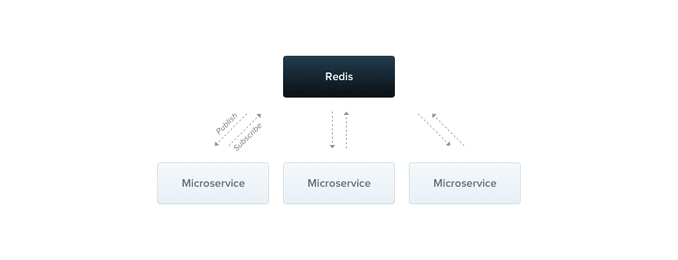

  

### Questions you asked me to answer:

  
  Part one: Data importer operators 
 -
1. What problems do you identify in the current setup? Please enumerate them with a brief description of why you believe they are problems, and what risks they carry.
>  **CLI scripts**: To me running CLI scripts as importer doesn't sound like the best option for multiple reasons:
>  - what if I need to **fix a bug** that I found in one script and I know all the other scripts also need that change too? For example the standard output format of these scripts. This **decreases maintainability**.
>  - As your platform grows, the number/complexity of these scripts are also likely to increase.
>  - As far as I understood these scripts could be completely different than each other when it comes to input data. 

**Assumption**: Assume that json structure below is your final desired json data format.

    { // Format 1 or desired format
	    id: number,
	    name: string,
	    date: Date,
    }
but you might come across APIs with the format below:

     { // Format 2 or input format
	    code: string,
	    full-name: string,
	    date: Date,
    }
2. What new architecture would you suggest that optimizes for performance, scalability, and reliability?

I suggest streamlining it. by providing a microservice as the template. This would mean every new Data importer would have a different data model than the other operator but the overall functionality of the microservice and the way it processes data stays the same. This of course comes with it's own disadvantages. To explain this idea a bit further, think about one data model which is the same across all the microservices for processing and providing an output but the developer can tweak the input field's name quickly and get it to work in a relatively short time.
The question is how to turn **format 2** into your **desired format** (which is format 1).
My suggestion is that the microservice template has to have the ability to read the data from format 2 and place those values automatically into format 1 data structure. So in this case, a developer can simply define that `code` in data model (in format 2) is what we need as `id` (format 1) to have the desired output. this of course has it's own advantages and disadvantages.

Advantages:
- faster adoption of new data models / APIs
- less mintainance, because the architecture of these microservices (which are replacement for the scripts) are the same. only the data model is different. data processing stays the same. 

Disadvantages:
- it hardly happens that the input data and output data has one to one relations. in most cases you require mix and matching. which can require time at first.

Part two: Notification Processor
-
1. What problems do you identify in the current setup? Please enumerate them with a brief description of why you believe they are problems, and what risks they carry.

If I had the choice to start somewhere, I would start with fixing the **Notification Processor**

>  **Notification Processor**: It appears that it has multiple functionalities: Post processing, Polling from queue. Pushing to DB. What I would do:
>  - break down the application into micro-services and I would make it event based. why? how? (please refer to solution section, as part of question 2)

  

2. What new architecture would you suggest that optimizes for performance, scalability, and reliability

Solution: Microservice event based architecture.

Behind all the hype and the buzz around the microservice and event based architecture, it could be really useful here actually. If you think about it, you are making the first steps towards this architecture anyways (pointing to the queuing mechanism in your diagram).

- Why you need this?

  

By breaking down the Notification Processor into 2/3 services you can achieve the scalability that you need. for example when it comes to post processing, if events are pilling up/down, you can simply increase/decrease workers to meet the demand.

Discussing the maintainability goes hand in hand with the size of the codebase. It's really simple, if the codebase is trying to do multiple things, it would be good at none of them (Jack of all, master of none). Also needless to say when on-boarding and off-boarding engineers, a small code base can speed up the process.

- How would you do it?

  

Since we are dealing with large number of data, I suggest Nodejs. Node engine is quite good at dealing with large quantity of data but not that good when it comes to CPU intensive tasks.

Just to showcase the simplicity of this approach, I will implement a simple Post Processing (as part of the Notification Processor) micro-service build using Redis queue. Please refer to attached schema in this readme.

  

**To showcase this approach: I will build a nodejs Microservice web server that uses Typescript for data modeling and model validation, uses Redis for handling/distributing events between workers.**

  

  
  

### Implementation

**Prerequisites:**

> node

  

> npm / yarn

  

> redis server

  

**How to run the project:**

  

1. Make sure your Redis server is running locally. use the link if you don't have locally. [https://redis.io/download](https://redis.io/download)

2. You need to run the microservice first on this directory: /solution/masterservice/

2. now you can run the masterservice on this directory: /solution/microservice/

3. How would you ensure your chosen architecture is working as expected?

  

**Calling the endpoint**

You can make a POST call to: localhost:3000/add with a body. you can use the cUrl request below:

  

curl -X POST \

http://localhost:3000/add \

-H 'Accept: */*' \

-H 'Accept-Encoding: gzip, deflate' \

-H 'Cache-Control: no-cache' \

-H 'Connection: keep-alive' \

-H 'Content-Length: 41' \

-H 'Content-Type: application/x-www-form-urlencoded' \

-H 'Host: localhost:3000' \

-H 'cache-control: no-cache' \

-d 'data%5B0%5D=1&data%5B1%5D=2&data%5B2%5D=3'

  

**What is happening and How is it related to the topic**

As you can see I created a micro-service that takes care of a simple operation. the master-service on the other hand is in charge of placing the requests on the Redis queue for the micro-services to pick up.

Using this architecture you can divide the Notification Processor and achieve:

- Highly maintainable and testable

- Loosely coupled

- Independently deployable

- Organized around business capabilities

- Owned by a small team

  

**Take away points and design decisions:**

- Scalability: you can add as many micro-services as you like to handle this simple operation. `2,,,3,,,1000`.

- Maintainability: I used Typescript on top of nodejs for modeling the data structure. this means that every function, every input, every output must be "typed". this helps to keep a clear and readable code.

- Quality: you can use Jest for unit testing every component. and have a estimated coverage.